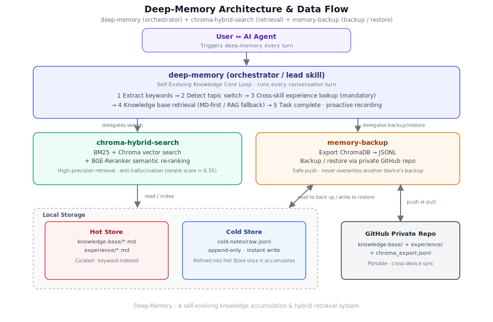
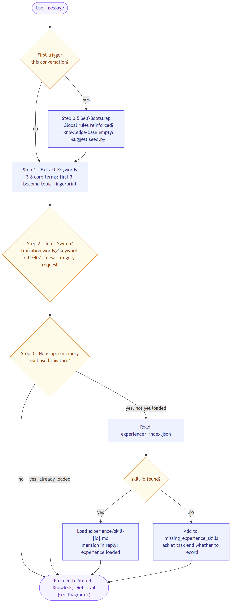
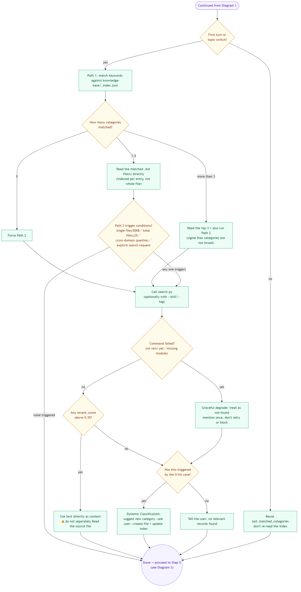
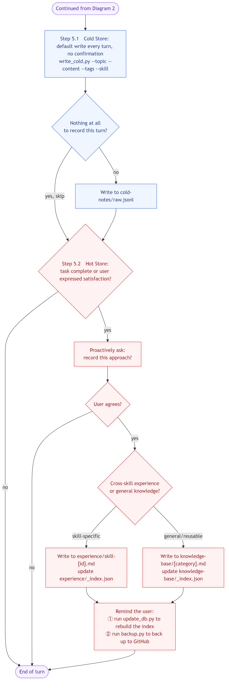

# Deep-Memory: A Self-Evolving Knowledge Accumulation & Hybrid Retrieval System

**English** | [繁體中文](README.zh-TW.md)

> 💡 **Project note**: This project is a deep refactor and rename of the original **[auto-skill](https://github.com/toolsai/auto-skill)** project. We restructured it into a minimal, modular open-source skill pack, decoupled "code" from "data," and integrated local ChromaDB hybrid retrieval with BGE-Reranker re-ranking.



This skill turns your AI agent from a tool that forgets everything the moment a session ends into a self-evolving "second brain" that gets better the more you use it.

Deep-Memory is a meta-skill designed for AI assistants. It runs as a background knowledge system that automatically retrieves past experience during conversations, captures best practices, and — once a task succeeds — proactively writes the "successful approach" into your private knowledge base and indexes it, intelligently cutting down on token usage. You just keep working as usual; Deep-Memory runs automatically in the background.

---

## Core Highlights

### 1. Genuinely Gets Stronger With Use
Traditional agents reset to zero the moment a conversation ends. Deep-Memory's Core Loop automatically checks a keyword index on every turn — if it recognizes a problem it has solved before, it directly recalls the "best solution" or "pitfall guide" from that time.

### 2. Cross-Skill Memory
Whenever you invoke another specific skill (coding, writing, drawing, etc.), Deep-Memory automatically checks its skill experience store.
Example: when you invoke `remotion-video-gen`, it proactively reminds you: "Last time we worked on this, setting FPS to 30 caused audio/video desync — we recommend switching to 60."

### 3. Proactive Experience Capture
You don't need to take notes by hand. When the AI detects that a task has been completed well, or you express satisfaction, it proactively asks:

> "We just solved [problem]. I'd like to record this so we have it on hand next time something similar comes up — sound good?"

### 4. Modular Skill Packaging & RAG Integration
- **Separation of concerns**: private data folders and binary files are completely removed from the package; the code ships independently.
- **Local hybrid retrieval**: integrates the `chroma-hybrid-search` sub-skill for local semantic + BM25 hybrid search, with CPU-based BGE-Reranker-base re-ranking.
- **Hot/cold tiered storage**: frequently-used curated knowledge lives in the hot store (`knowledge-base/`, `experience/`); fresh, unrefined conversation notes land first in the cold store (`cold-notes/raw.jsonl`) and get refined into hot-store entries once enough accumulate.

### 5. Cross-Device Portability & Safe Backup
Integrates the `memory-backup` sub-skill: export your knowledge base and push it to your own private GitHub repo in one step; restore safely via `restore.py` on a new machine (by default it only fills in missing files and never overwrites existing ones). Before pushing, it automatically checks whether the remote is ahead, so devices never silently overwrite each other's backups.

---

## How It Works (The Loop)

Deep-Memory runs a disciplined 5-step loop on every conversation turn:

1. **Keyword Fingerprinting**
   Extracts core keywords from the conversation to generate a topic fingerprint.

2. **Topic Switch Detection**
   Intelligently determines whether the user has started a new topic, deciding whether the knowledge base needs to be re-read.

3. **Experience Lookup (Skill Experience)**
   If a specific skill was used, mandatorily checks for past "pitfall records" or "working parameters."

4. **General Knowledge Base Retrieval**
   Automatically matches the index based on task type and loads the relevant best practices.

5. **Proactive Recording (Write Back)**
   Once a task reaches a high degree of completion, extracts and writes back the core takeaway.

**Full decision flow, split into three diagrams (kickoff → retrieval → recording):**







*Mermaid source for these diagrams lives in `assets/diagrams/*.mmd`. Regenerate with: `mmdc -i assets/diagrams/flow-1-kickoff.en.mmd -o assets/flow-1-kickoff.en.png -b white -s 2 -w 1000` (swap the filename for each diagram).*

---

## File Structure & Format

### 1) Skill Install Package (GitHub Release Pack)
```text
skills/
├── deep-memory/
│   ├── SKILL.md                 # Lead protocol and flow control
│   ├── scripts/seed.py          # Installs the bundled seed knowledge base
│   └── resources/                # Recording format & hot/cold rules (loaded on demand)
├── chroma-hybrid-search/
│   ├── SKILL.md                 # Hybrid retrieval sub-skill spec
│   ├── requirements.txt         # Local AI dependency declarations
│   └── scripts/
│       ├── search.py            # RAG retrieval + rerank
│       ├── update_db.py         # Local vector database init / update
│       └── write_cold.py        # Instant write to the cold store (cold-notes/)
├── memory-backup/
│   ├── SKILL.md                 # GitHub backup/restore sub-skill spec
│   └── scripts/
│       ├── backup.py            # Export and safely push to a private GitHub repo
│       ├── restore.py           # Restore the knowledge base from GitHub on any device
│       └── export_jsonl.py      # ChromaDB → portable JSONL export
└── memory-import/
    ├── SKILL.md                 # External memory import sub-skill spec
    └── scripts/import.py        # Imports ChatGPT / Claude local / legacy auto-skill data
```

### 2) Private Data Store (created under your home directory, shared by every project)
All scripts default `--workspace` to `~/.deep-memory` — one store for every project on the machine, not a folder created inside each project. Set `--workspace` (or the `DEEP_MEMORY_WORKSPACE` env var) explicitly if you want a project to keep a fully isolated store instead.
```text
~/.deep-memory/
├── knowledge-base/              # Hot store: curated, keyword-indexed
│   ├── _index.json              # Keyword index
│   └── backend-dev.md           # Your own domain-knowledge handbook
├── experience/                  # Hot store: skill-specific pitfalls & lessons
│   ├── _index.json              # Skill index
│   └── skill-python-code.md     # Gotchas for a specific tool
├── cold-notes/
│   └── raw.jsonl                # Cold store: instant write, refined into the hot store once it accumulates.
│                                 # Each entry auto-tags a `project` field (from the calling directory's name)
│                                 # and a `memory_type` field (knowledge / experience / both)
│                                 # so search.py can look at the current project before falling back to everything.
├── chroma_hybrid_db/            # Locally-built ChromaDB binaries (indexes both hot and cold stores)
└── backup/                      # memory-backup's staging area (its own git repo, pushed to GitHub)
```

---

## Usage

### Installation Model (pick one)

| Model | Where the skills live | Command path | Best for |
|---|---|---|---|
| **Global (recommended)** | Copy to your agent's global skill library (e.g., `~/.gemini/config/skills/` for Antigravity, `~/.claude/skills/` for Claude Code) | Point to that global path, or use it directly as a global agent skill | Best default, sharing one skill installation across all workspaces |
| **Quick install** | `npx skills add -g` fetches straight from GitHub into your global agent skill library | Use global paths (e.g., `~/.gemini/config/skills/...`) | Fastest way to get started with global installation |
| **In-project** | Copy `skills/` into your project root | Use `skills/...` directly (matches every SKILL.md example) | Single project use-case, want it fully self-contained |

> All data directories (`knowledge-base/`, `experience/`, `chroma_hybrid_db/`) are always created under **your home directory** (`~/.deep-memory`), regardless of where the skills themselves live or which project you're in — the scripts use `--workspace` (default: `~/.deep-memory`, overridable via `DEEP_MEMORY_WORKSPACE`) to decide where to read/write. This single store is shared across every project; cold-store entries carry a `project` field so retrieval favors the current project before falling back to everything else.

#### Quick Install with `npx skills add`

[`skills`](https://github.com/vercel-labs/skills) is a small CLI that installs Agent Skills straight from a public GitHub repo — no cloning needed. Since this repo keeps its skills under `skills/`, the tool discovers them automatically:

```bash
# Preview what's available before installing
npx skills add kevintsai1202/deep-memory --list

# Install everything globally, no prompts (shorthand for --skill '*' --agent '*' -y -g)
npx skills add kevintsai1202/deep-memory --all -g

# Or be explicit about the target agent and install globally
npx skills add kevintsai1202/deep-memory --skill '*' -a claude-code -g

# Or install just the core skill globally
npx skills add kevintsai1202/deep-memory --skill deep-memory -a claude-code -g
```

> Adding `-g` installs the skills into your global skill library (e.g. `~/.gemini/config/skills/` or `~/.claude/skills/`), making them available across all your workspaces.
> `--all` installs into **every** agent the CLI recognizes (Claude Code, Cursor, Codex, etc.). Use `-a <agent-name> -g` if you only want it in a specific agent's global path.

This only places the skill files — you still need to run the Python initialization steps below, once per machine (the venv and all data live in the global `~/.deep-memory` workspace, shared by every project).

### Initialization Steps

1. Pick an install model from the table above and place `skills/` accordingly (skip this if you used `npx skills add`).
2. Initialize the virtual environment, install dependencies, seed the bundled knowledge base, and build the local vector index (**no need to activate — call the venv's Python directly**):

   **Windows (PowerShell)**
   ```powershell
   python -m venv "$HOME\.deep-memory\.venv"
   & "$HOME\.deep-memory\.venv\Scripts\python" -m pip install -r skills/chroma-hybrid-search/requirements.txt
   & "$HOME\.deep-memory\.venv\Scripts\python" skills/deep-memory/scripts/seed.py
   & "$HOME\.deep-memory\.venv\Scripts\python" skills/chroma-hybrid-search/scripts/update_db.py
   ```

   **Linux / macOS**
   ```bash
   python3 -m venv ~/.deep-memory/.venv
   ~/.deep-memory/.venv/bin/python -m pip install -r skills/chroma-hybrid-search/requirements.txt
   ~/.deep-memory/.venv/bin/python skills/deep-memory/scripts/seed.py
   ~/.deep-memory/.venv/bin/python skills/chroma-hybrid-search/scripts/update_db.py
   ```

   `knowledge-base/` is created by `seed.py`; `experience/` and `cold-notes/` are created automatically the first time something is written to them — no manual `mkdir` needed.

   > If you installed globally (recommended) or via `npx skills add -g`, swap `skills/...` in the commands above for the actual path where the files were placed (typically `~/.gemini/config/skills/...` or `~/.claude/skills/...`).

---

## Changelog

### 2026-07-07

- Cold-store entries now carry `memory_type` (`knowledge`, `experience`, or `both`) so refinement can route general knowledge to `knowledge-base/` and skill/tool lessons to `experience/skill-[skill-id].md` instead of mixing everything into one bucket. `write_cold.py` accepts `--memory-type`, `search.py` can filter with `--memory-type`, and the dashboard shows a memory-type distribution panel.
- Added `skills/deep-memory/scripts/migrate_memory_type.py` to backfill `memory_type` into existing `cold-notes/raw.jsonl` files before rebuilding the vector index.

### 2026-07-06

- New **Memory Dashboard** (`skills/deep-memory/scripts/viz.py`): a single-file, self-contained, offline-openable interactive HTML dashboard of your memory. Pure Python standard library — no venv, no pip. Run `python skills/deep-memory/scripts/viz.py` (or just say "產生記憶儀表板" / "memory dashboard") and open the printed HTML path in any browser.
- The centrepiece is a **tripartite knowledge graph** (category ── term ── project). Knowledge-base keywords and cold-note tags are unified into shared *term* nodes, so a term that is both a keyword and a tag bridges the knowledge you documented to the projects you actually used it in. Knowledge vs. experience categories, projects, and keyword / tag / bridge terms are all colour-coded, rendered with a live force-directed layout and draggable nodes, canvas pan, wheel zoom, reset, search, click-to-focus, hover labels, and per-type show/hide toggles. Five stat panels accompany it: per-category size, cold-notes timeline, tag heat Top-N, project distribution, and quality (raw vs. reviewed) ratio.


### 2026-07-02

- Cold-store entries now auto-tag a `project` field (derived from the calling directory's name); `search.py` searches the current project first and only falls back to the full store when nothing project-specific matches. `search.py`'s output shape changed from a bare array to `{"scope": "...", "results": [...]}`.
- Entries written before this change have no `project` field and are only reachable via the fallback pass — they were intentionally left as-is, not backfilled.
- Documentation fix: this README previously described the private data store as being created under your project directory. It was already always created under `~/.deep-memory` by default — that part of the docs was simply wrong, not a behavior change.
