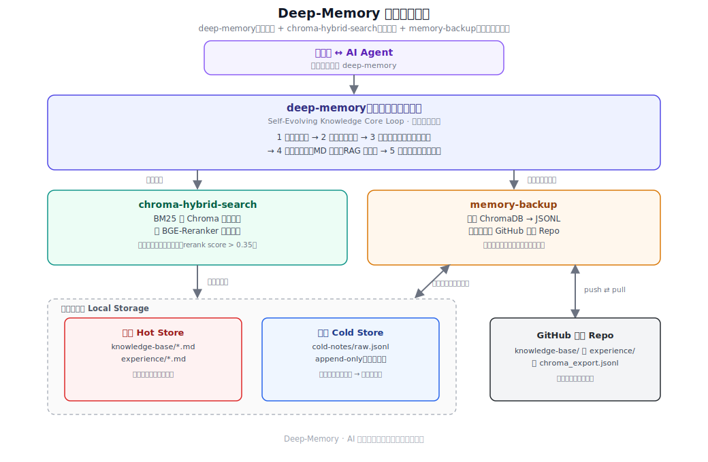
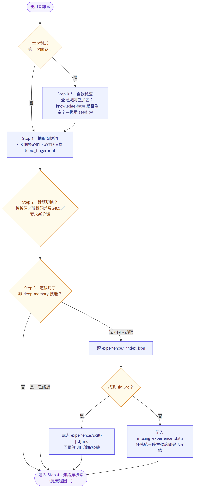
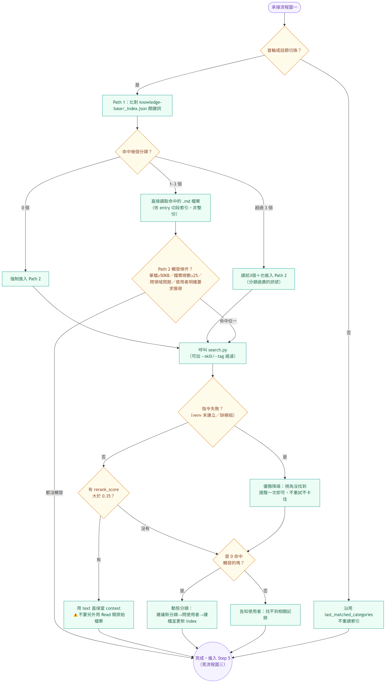
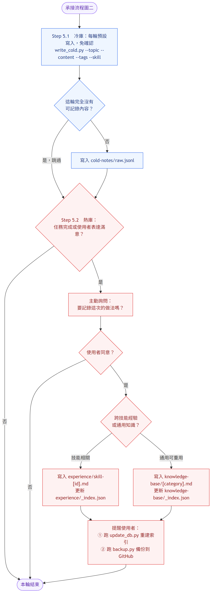
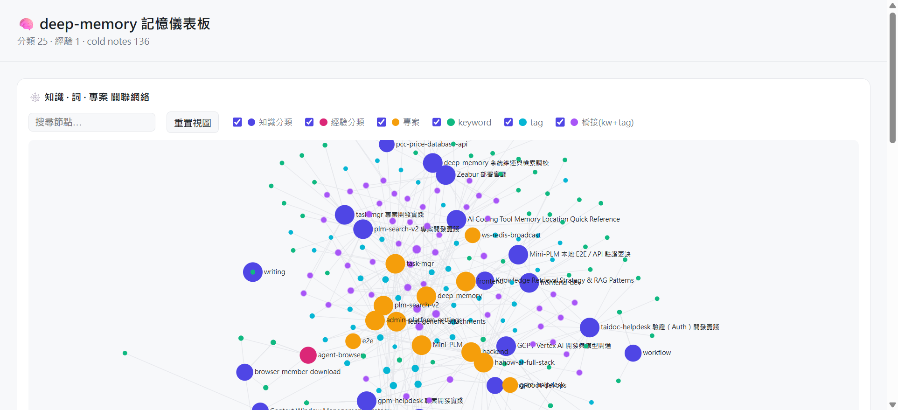

# Deep‑Memory：AI 自進化知識積累與混合檢索系統

[English](README.md) | **繁體中文**

> 💡 **專案說明**：本專案是由原 **[auto-skill](https://github.com/toolsai/auto-skill)** 專案深度優化與更名演進而來。我們將其重構為極簡且模組化的開源技能包，解耦了「代碼與資料」，並整合了本地 ChromaDB 混合檢索與 BGE-Reranker 重排能力。



這個技能是讓你的 AI Agent 不再是「用完即忘」的工具，而是越用越懂你的自進化「第二大腦」。

Deep‑Memory 是一個為 AI Assistant 設計的元技能（Meta‑Skill）。它作為背景運行的知識系統，能在對話過程中自動檢索過往經驗、捕捉最佳實踐，並在任務成功時主動將「成功經驗」寫入你的私人知識庫並建立索引，聰明地減少 Tokens 消耗。你只需要照常提出需求，Deep‑Memory 就會在背景自動運作。

---

## 核心亮點

### 1. 真正的「越用越強」

傳統的 Agent 對話結束即歸零。Deep‑Memory 透過核心循環（Core Loop），在每次對話中自動檢查關鍵字索引，若發現這是過去解決過的問題，會直接調用當時的「最佳解法」或「避坑指南」。

### 2. 跨技能經驗層（Cross‑Skill Memory）

當你呼叫其他特定 Skill（如 Coding、寫作、繪圖）時，Deep‑Memory 會自動檢查技能經驗庫。
例如：當你調用 `remotion-video-gen` 時，它會主動提醒：「上次我們在做這個時，發現設定 FPS 30 會導致音畫不同步，建議改為 60。」

### 3. 主動式經驗捕獲

你不需要手動整理筆記。當 AI 偵測到任務圓滿完成，或你表達滿意時，它會主動詢問：

> 「這次解決了 [問題]，我想把這個經驗記錄下來，下次遇到類似問題可以直接參考，你覺得可以嗎？」

### 4. 模組化技能封裝與 RAG 整合

- **職責分離**：完全移除了私有資料夾與二進位檔案，程式碼獨立打包發布。
- **本機混合檢索**：整合子技能 `chroma-hybrid-search`，提供本地語意 + BM25 混合檢索，並藉由 CPU 運行 BGE-Reranker-base 重排。
- **冷熱分層儲存**：高頻取用的精選知識存於熱庫（`knowledge-base/`、`experience/`），即時但未精煉的對話筆記先落地冷庫（`cold-notes/raw.jsonl`），累積到一定量再精煉升級為熱庫條目。

### 5. 跨裝置可攜與安全備份

整合子技能 `memory-backup`：一鍵將知識庫匯出並推送至你自己的 GitHub 私有 Repo；換新機器時透過 `restore.py` 安全還原（預設僅補齊缺少的檔案、不覆蓋既有內容）。推送前會自動偵測遠端是否領先，避免多裝置互相覆蓋彼此的備份。

---

## 運作邏輯（The Loop）

Deep‑Memory 在每一輪對話中執行嚴謹的 5 步循環：

1. **關鍵詞指紋 (Fingerprinting)**
   從對話中提取核心關鍵詞，生成話題指紋。
2. **話題切換偵測**
   智能判斷用戶是否開啟新話題，決定是否重讀知識庫。
3. **經驗讀取 (Skill Experience)**
   若使用了特定技能，強制檢查是否有過往的「踩坑紀錄」或「成功參數」。
4. **通用知識庫檢索 (Knowledge Base)**
   根據任務類型自動比對索引，載入最佳實踐。
5. **主動記錄 (Write Back)**
   在任務高完成度結束時，執行任務核心提取寫入。

**完整決策流程，拆成三張圖（啟動 → 檢索 → 記錄）：**







*這些圖的 Mermaid 原始碼放在 `assets/diagrams/*.mmd`，重新產生指令：`mmdc -i assets/diagrams/flow-1-kickoff.zh.mmd -o assets/flow-1-kickoff.zh.png -b white -s 2 -w 1000`（依圖檔名稱替換）。*

---

## 檔案結構與格式

### 1) 技能安裝包 (GitHub Release Pack)

```text
skills/
├── deep-memory/
│   ├── SKILL.md                 # 主導協議與流程控制
│   ├── scripts/seed.py          # 預載種子知識庫安裝
│   └── resources/                # 記錄格式・冷熱庫規則（延伸文件，依需求載入）
├── chroma-hybrid-search/
│   ├── SKILL.md                 # 混合檢索子技能說明
│   ├── requirements.txt         # 本地 AI 依賴庫宣告
│   └── scripts/
│       ├── search.py            # RAG 檢索與 Rerank
│       ├── update_db.py         # 本地向量資料庫初始化／更新
│       └── write_cold.py        # 冷庫（cold-notes/）即時寫入
├── memory-backup/
│   ├── SKILL.md                 # GitHub 備份／還原子技能說明
│   └── scripts/
│       ├── backup.py            # 匯出並安全推送至 GitHub 私有 Repo
│       ├── restore.py           # 跨裝置從 GitHub 還原知識庫
│       └── export_jsonl.py      # ChromaDB → 可攜式 JSONL 匯出
└── memory-import/
    ├── SKILL.md                 # 外部記憶匯入子技能說明
    └── scripts/import.py        # 匯入 ChatGPT／Claude 本機／舊 auto-skill 資料
```

### 2) 私有資料庫（建立在使用者 home 目錄下，所有專案共用同一份）

所有腳本的 `--workspace` 預設值都是 `~/.deep-memory`——是全機器所有專案共用的單一儲存區，不會在每個專案底下各自建立一份。若想讓特定專案擁有完全獨立的資料庫，可明確指定 `--workspace`（或設定 `DEEP_MEMORY_WORKSPACE` 環境變數）覆蓋預設值。

```text
~/.deep-memory/
├── knowledge-base/              # 熱庫：人工精選、關鍵詞索引
│   ├── _index.json              # 關鍵詞索引
│   └── backend-dev.md           # 您的領域知識手冊
├── experience/                  # 熱庫：技能專屬踩坑經驗
│   ├── _index.json              # 技能索引
│   └── skill-python-code.md     # 特定工具的踩坑經驗
├── cold-notes/
│   └── raw.jsonl                # 冷庫：即寫即用，累積到閾值後精煉升級至熱庫。
│                                 # 每筆條目會自動標記 project 欄位（取自觸發指令當下的目錄名稱），
│                                 # 讓 search.py 能先比對當前專案，找不到才退回全庫搜尋
├── chroma_hybrid_db/            # 本地編譯之 ChromaDB 二進位（熱庫＋冷庫皆會索引）
└── backup/                      # memory-backup 暫存區（獨立 git 倉庫，推送至 GitHub）
```

---

## 如何使用

### 安裝模型（擇一）


| 模型                 | 技能放哪                                                | 指令路徑                                                                | 適用                         |
| ---------------------- | --------------------------------------------------------- | ------------------------------------------------------------------------- | ------------------------------ |
| **全域（推薦）**             | 複製到你的 Agent 全域技能庫（例如 Antigravity 的 `~/.gemini/config/skills/`、Claude Code 的 `~/.claude/skills/`）        | 使用全域路徑，或直接作為全域 Agent 技能調用 | 最推薦的預設模式，多專案共用同一套技能 |
| **快速安裝** | 用`npx skills add -g` 直接從 GitHub 抓進全域技能庫 | 使用全域路徑（例如 `~/.gemini/config/skills/...`） | 最快完成全域安裝的方式 |
| **專案內**           | 把`skills/` 複製到專案根目錄                            | 直接用`skills/...`（各 SKILL.md 的範例即如此）                          | 單一專案、想要完全獨立與可攜 |

> 所有資料目錄（`knowledge-base/`、`experience/`、`chroma_hybrid_db/`）一律建立在「你的 home 目錄」下（`~/.deep-memory`），與技能放哪、目前在哪個專案都無關——腳本透過 `--workspace`（預設為 `~/.deep-memory`，可用 `DEEP_MEMORY_WORKSPACE` 環境變數覆蓋）決定讀寫位置。這是所有專案共用的單一儲存區；冷庫條目會標記 `project` 欄位，讓檢索優先比對當前專案，找不到才退回全庫。

#### 用 `npx skills add` 快速安裝

[`skills`](https://github.com/vercel-labs/skills) 是一個小型 CLI，可以直接從公開的 GitHub Repo 安裝 Agent Skills，不需要手動 clone。因為本專案的技能放在 `skills/` 目錄下，這個工具會自動探索到它們：

```bash
# 安裝前先預覽有哪些技能
npx skills add kevintsai1202/deep-memory --list

# 全域安裝所有技能、不詢問（等同 --skill '*' --agent '*' -y -g 的簡寫）
npx skills add kevintsai1202/deep-memory --all -g

# 或明確指定只安裝到 Claude Code 的全域技能庫
npx skills add kevintsai1202/deep-memory --skill '*' -a claude-code -g

# 或只全域安裝核心技能
npx skills add kevintsai1202/deep-memory --skill deep-memory -a claude-code -g
```

> 加上 `-g` 會把技能裝進你的全域技能庫（例如 `~/.gemini/config/skills/` 或 `~/.claude/skills/`），這能讓你在所有專案中都能存取這些技能。
> `--all` 會把技能裝進 CLI 認得的**每一個** Agent（Claude Code、Cursor、Codex 等）；如果只想裝進特定 Agent 的全域路徑，請用 `-a <agent-name> -g`。

這只會放好技能檔案，下方的 Python 初始化步驟每台機器執行一次即可（venv 與所有資料都放在全域 `~/.deep-memory`，所有專案共用）。

### 初始化步驟

1. 依上表選擇安裝模型，放好 `skills/`（若你是用 `npx skills add` 安裝，這步可跳過）。
2. 初始化虛擬環境、安裝依賴套件、安裝種子知識庫、建立本機向量索引（**不需 activate，直接呼叫 venv 內的 Python**）：

   **Windows (PowerShell)**

   ```powershell
   python -m venv "$HOME\.deep-memory\.venv"
   & "$HOME\.deep-memory\.venv\Scripts\python" -m pip install -r skills/chroma-hybrid-search/requirements.txt
   & "$HOME\.deep-memory\.venv\Scripts\python" skills/deep-memory/scripts/seed.py
   & "$HOME\.deep-memory\.venv\Scripts\python" skills/chroma-hybrid-search/scripts/update_db.py
   ```
   **Linux / macOS**

   ```bash
   python3 -m venv ~/.deep-memory/.venv
   ~/.deep-memory/.venv/bin/python -m pip install -r skills/chroma-hybrid-search/requirements.txt
   ~/.deep-memory/.venv/bin/python skills/deep-memory/scripts/seed.py
   ~/.deep-memory/.venv/bin/python skills/chroma-hybrid-search/scripts/update_db.py
   ```
   `knowledge-base/` 由 `seed.py` 自動建立；`experience/` 與 `cold-notes/` 則在第一次真正寫入時自動建立，不需手動 `mkdir`。

   > 若你是安裝在全域（推薦）或使用 `npx skills add -g` 安裝，請把上面的 `skills/...` 換成該工具實際放置的位置（例如 `~/.gemini/config/skills/...` 或 `~/.claude/skills/...`）。

---

## Changelog

### 2026-07-06

- 新增**記憶儀表板**（`skills/deep-memory/scripts/viz.py`）：把你的記憶產成一份單檔、自帶資料、可離線開啟的互動 HTML 儀表板。純 Python 標準函式庫——不需 venv、不需 pip。執行 `python skills/deep-memory/scripts/viz.py`（或直接說「產生記憶儀表板」／「memory dashboard」），再用瀏覽器打開腳本印出的路徑即可。
- 核心是一張**三分知識圖譜**（分類 ── 詞 ── 專案）。知識庫的 keyword 與 cold notes 的 tag 統一成共用的「詞」節點，因此同時是 keyword 又是 tag 的詞，會把「你記錄下來的知識」與「你實際用到它的專案」橋接起來。知識分類 vs. 經驗分類、專案、以及 keyword／tag／橋接詞皆以顏色區分，採即時力導向版面並支援節點拖曳、畫布平移、滾輪縮放、重置、搜尋、點擊聚焦鄰域、hover 顯示名稱、依類型開關顯示。另附五張統計面板：各分類規模、cold notes 時間趨勢、標籤熱度 Top-N、專案分布、品質（raw vs. reviewed）佔比。



### 2026-07-02

- 冷庫條目新增 `project` 欄位（取自觸發指令當下的目錄名稱自動標記）；`search.py` 會先比對當前專案，找不到符合結果才退回全庫搜尋。`search.py` 的回傳格式也從純陣列改成 `{"scope": "...", "results": [...]}`。
- 這次改動前寫入的舊條目沒有 `project` 欄位，只會出現在退回全庫搜尋的那一次查詢——刻意不補標，維持歷史資料原樣。
- 文件修正：本 README 先前把私有資料庫描述成「建立在你的專案下」，這是文件寫錯，實際上一直都是預設建立在 `~/.deep-memory`，並非這次才改變的行為。
