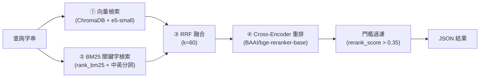

# Deep-Memory RAG 技術說明文件

> 本文件獨立說明 deep-memory 系統所使用的 RAG（Retrieval-Augmented Generation，檢索增強生成）技術：整體架構、索引管線、混合檢索管線、觸發時機與防幻覺守則。
>
> 對應實作位置：[skills/chroma-hybrid-search/](../skills/chroma-hybrid-search/)
> - 檢索腳本：`scripts/search.py`
> - 索引腳本：`scripts/update_db.py`
> - 共用讀取／切段邏輯：`scripts/kb_reader.py`
> - 冷庫寫入：`scripts/write_cold.py`
> - 輕量 ONNX 推論：`scripts/onnx_models.py`（設計緣由與效能數據見 [onnx-optimization.md](onnx-optimization.md)）

---

## 1. RAG 在本系統中的定位

deep-memory 的知識檢索採 **「MD 關鍵字比對優先 → RAG 語意檢索後援」** 的雙路策略（deep-memory SKILL.md Step 4）：

| 路徑 | 技術 | 適用情境 |
|---|---|---|
| Path 1 | `_index.json` 關鍵字比對 + 直接讀 MD 檔 | 分類少、關鍵字命中明確時的快速路徑（預設） |
| Path 2 | **ChromaDB 混合式 RAG**（本文件主題） | 關鍵字比對失效或知識庫規模超過門檻時 |

**Path 2（RAG）的觸發條件：**

| 觸發條件 | 原因 |
|---|---|
| 關鍵字比對 **0 個分類命中** | 索引關鍵字清單無法涵蓋提問，先用語意檢索確認知識是否真的不存在 |
| 知識庫 `*.md` 檔案數 ≥ **25** | 分類太多，關鍵字比對不再可靠 |
| 任一 `.md` 檔 ≥ **50 KB** | 整檔讀入會稀釋 context window，改用 RAG 只取相關條目 |
| 提問**跨多個領域**（如「比較 A 與 B」） | 單一關鍵字無法準確匹配跨域問題 |
| 使用者**明確要求搜尋**（「幫我找」「有沒有記錄」） | 明確的檢索意圖 |

---

## 2. 資料層：熱庫／冷庫雙層記憶

RAG 的檢索對象涵蓋兩層儲存，**全部集中在使用者家目錄的全域儲存區 `~/.deep-memory`**（可用環境變數 `DEEP_MEMORY_WORKSPACE` 或 `--workspace` 覆寫）：

| 層 | 位置 | 格式 | 特性 |
|---|---|---|---|
| **熱庫（Hot Store）** | `knowledge-base/*.md`、`experience/*.md` | 結構化 Markdown | 已精煉、有關鍵字索引、每個 `## 🔧` 條目獨立索引 |
| **冷庫（Cold Store）** | `cold-notes/raw.jsonl` | JSONL 逐行追加 | 每回合無確認即時寫入的原始筆記，只能透過 RAG 檢索 |
| **向量庫** | `chroma_hybrid_db/` | ChromaDB 持久化二進位索引 | 由 `update_db.py` 掃描上述兩層產生，**不進版控** |

冷庫條目帶有 `project` 欄位（由 `write_cold.py` 依呼叫當下的工作目錄名稱自動填入），供檢索時做「先搜本專案、再退回全庫」的範圍控制（見 §4.5）。

---

## 3. 索引管線（`update_db.py`）

### 3.1 條目級切段（Entry-Level Chunking）

切段邏輯集中在 `kb_reader.py`，`update_db.py` 與 `search.py` 共用同一份，確保「索引時看到的文件集合」與「查詢時能對回文字的文件集合」永遠一致：

- 熱庫 MD 檔以 `## 🔧 ` 標題為切段邊界（`split_entries()`），**一個條目 = 一份向量文件**，而非整檔一份。
- 每個條目由標題產生穩定、可讀的 slug（`slugify()`，同檔重複標題自動加序號），文件 id 形如 `experience/skill-xxx.md#fps-30-causes-av-desync`。
- 檔案完全沒有 `## 🔧` 標題時（不符範本的舊檔），退回整檔索引以維持向下相容。
- 小於 200 bytes 的檔案與 `_index.json` 直接略過。
- 冷庫每行 JSON 組合成固定格式文字（主題／日期／技能／標籤／內容），id 形如 `cold-notes/raw.jsonl#L12`。

### 3.2 Metadata 設計

每份文件寫入 ChromaDB 時附帶：

| 欄位 | 來源 | 用途 |
|---|---|---|
| `source` | `hot` / `cold` | 區分熱庫／冷庫 |
| `skill` | `experience/skill-[id].md` 檔名，或冷庫條目的 `skill` 欄位 | `--skill` 精準過濾 |
| `tags` | experience 條目的 `**keywords:**` 行，或冷庫條目的 `tags` 陣列 | `--tag` 過濾（Chroma 原生 `$contains`，需 chromadb ≥ 1.5.0） |
| `project` | 冷庫條目的 `project` 欄位 | 專案優先檢索；舊條目無此欄位、刻意不補填，視為「不屬於任何專案」 |

### 3.3 Embedding 模型與寫入

- Embedding 模型：**`intfloat/multilingual-e5-small`**（ONNX 權重，`onnxruntime` CPU 直接推論，見 `scripts/onnx_models.py`）——多語模型，支援中英混合語料的跨語言語意檢索。不經 sentence-transformers / torch，冷啟動由十餘秒降至約 2 秒，輸出與 torch 版數值一致（cosine = 1.0）。
- 集合名稱：`hybrid_docs`，使用 `chromadb.PersistentClient` 落地到 `chroma_hybrid_db/`。
- 寫入採 `upsert`：同 id 覆寫、新 id 新增。
- **孤立向量清理**：upsert 不會自動移除已刪除／改名來源的舊向量，因此每次重建會比對「當前應存在的 ids」與「向量庫實際 ids」，主動刪除差集。

### 3.4 重建時機（節錄）

`update_db.py` 為**增量索引**：只對新增或文本變動的條目重算向量，metadata-only 變動不重算，零變動的執行約 1 秒完成（此時完全不載入模型）。仍**不建議每次寫入就觸發**：

- 熱庫有新增／修改內容 → 必須重建（否則 RAG 找不到新條目）。
- 冷庫本回合有寫入且**即將發生 RAG 查詢** → 查詢前 lazy 重建。
- 冷庫累積 ≥ 5 筆新條目 → 批次重建。
- 只有排版變動、或本回合只查詢不寫入 → 不需重建。

> ⚠️ `write_cold.py` 只是把 JSONL 追加到冷庫（純文字備份），**寫入 ≠ 向量化**——未跑 `update_db.py` 前，RAG 查不到這些新條目。

---

## 4. 檢索管線（`search.py`）

一次完整的 `hybrid-rerank` 查詢會經過四個階段：



### 4.1 ① 向量檢索（語意召回）

以 `multilingual-e5-small` 將查詢向量化，對 `hybrid_docs` 集合做相似度查詢，取前 `--candidate-limit`（預設 10）名候選。`--skill` / `--tag` / 專案範圍轉為 Chroma 的 `where` 子句，確保向量端與 BM25 端看到**一致的候選集合**。

### 4.2 ② BM25 關鍵字檢索（精確召回）

- 使用 `rank_bm25` 的 `BM25Okapi`，對當前文件集合即時建立語料。
- 自製中英混合分詞器 `tokenize()`：**中文逐字切分**（`[一-鿿]`）＋**英文詞／數字／識別字**（`[a-zA-Z0-9_-]+`，轉小寫）——不依賴外部斷詞器，也能同時處理中文敘述與 `pxmin`、`RedisSessionMiddleware` 這類程式識別字。
- 只保留分數 > 0 的文件，依分數排序。

### 4.3 ③ RRF 融合（Reciprocal Rank Fusion）

兩路排名以 RRF 合併：每份文件的分數 = Σ 1 / (k + rank)，**k = 60** 為 Cormack et al. 文獻標準常數——壓低低名次的影響力，避免只被單一方法找到的文件過度主導。融合後取前 `--candidate-limit` 名進入重排。

### 4.4 ④ Cross-Encoder 語意重排

- 模型：**`BAAI/bge-reranker-base`**（CrossEncoder，CPU 執行）。
- 與雙塔式（bi-encoder）向量檢索不同，Cross-Encoder 將「查詢＋文件」成對送入模型逐一評分，精度更高、成本也更高——因此只對融合後的少量候選執行。
- 依 `rerank_score` 排序、套用 `--min-score`，最終回傳前 `--limit`（預設 4）筆。
- **門檻守則：呼叫時帶 `--min-score 0.35`，讓過濾發生在檢索端**；`results` 為空視為「知識庫查無相關記錄」。檢索端過濾同時是專案優先 fallback（見 4.5）能正常運作的前提。

### 4.5 專案優先的兩段式檢索

`search.py` 針對全域共用儲存區設計了範圍控制：

1. 先將文件集合縮小到 `project == 當前工作目錄名稱`（可用 `--project` 覆寫，傳 `all` 停用），跑一次完整的 ①〜④。
2. 若無結果，退回**全庫**再跑一次——這樣跨專案通用知識（如 git／部署技巧）仍找得到，又不會讓無關專案的筆記平時擠掉相關結果。注意 fallback 只看「專案輪有沒有結果」，不看分數高低，所以必須搭配 `--min-score 0.35`：低分的專案內命中會先被濾掉，fallback 才能觸發；否則一筆 rerank_score 接近 0 的無關專案條目就足以擋住全庫搜尋。
3. 無 `project` 欄位的舊冷庫條目與熱庫條目視為「不屬於任何專案」，只會出現在退回全庫的那一輪。

輸出 JSON 的 `scope` 欄位標示命中範圍（`project:xxx` 或 `all`）。

### 4.6 檢索模式

| 模式 | 流程 | 適用情境 |
|---|---|---|
| `hybrid-rerank`（預設） | 向量 + BM25 + RRF + 重排 | 需要深度語意理解的複雜問題（建議預設） |
| `hybrid` | 向量 + BM25 + RRF（不重排） | 想省重排成本的一般查詢 |
| `vector` | 僅向量檢索 | 跨語言／模糊語意搜尋 |
| `bm25` | 僅關鍵字檢索 | 找精確專有名詞、變數名、程式碼片段 |

### 4.7 指令與輸出格式

```bash
# 標準混合檢索 + 重排（<PY> = ~/.deep-memory/.venv 的 Python；Windows PowerShell 用 & "$HOME\.deep-memory\.venv\Scripts\python"）
<PY> skills/chroma-hybrid-search/scripts/search.py --query "spring 動畫參數調校" --limit 3 --min-score 0.35

# 限定技能／標籤
<PY> skills/chroma-hybrid-search/scripts/search.py --query "session timeout" --skill backend-dev
<PY> skills/chroma-hybrid-search/scripts/search.py --query "config drift" --tag redis
```

```json
{
  "scope": "project:deep-memory",
  "results": [
    {
      "path": "experience/skill-remotion-best-practices.md#fps-30-causes-av-desync",
      "rerank_score": 0.9402,
      "text": "## 🔧 FPS 30 causes A/V desync\n**Date:** ...（只有這一個條目，不含檔案其餘內容）"
    }
  ]
}
```

---

## 5. 防幻覺守則（Anti-Hallucination Routing）

1. **檔名優先**：提問明確提到檔名時，直接讀該檔全文，不繞道 RAG。
2. **分層 RAG**：檔名比對失敗才退到 `search.py` 混合檢索＋重排。
3. **分數門檻**：`rerank_score ≤ 0.35` 的結果一律不進入模型 context，避免雜訊污染回答品質。
4. **`text` 即上下文**：結果的 `path` 帶 `#entry-slug`，僅供引用出處；**直接使用回傳的 `text`，不要再用 Read 開整份來源檔**——重讀整檔等於推翻條目級切段、把同檔所有無關條目倒回 context。
5. **冷庫一律走 RAG**：向量化後不再直接讀 `raw.jsonl` 做檢索（唯一例外是精煉流程，它需要全語料的 tags/skill/date 做聚類，非單一查詢的 top-K 模型能涵蓋）。

---

## 6. 地端 RAG 架構（Fully Local RAG）

本系統是**純地端（on-premises / fully local）RAG**：從資料儲存、向量化、索引到檢索重排，整條管線都在使用者本機執行，**不呼叫任何雲端 LLM API 或向量資料庫服務**。

### 6.1 全離線的組成

| RAG 環節 | 常見雲端做法 | 本系統地端做法 |
|---|---|---|
| 資料儲存 | 雲端向量服務（Pinecone、Weaviate Cloud 等） | ChromaDB `PersistentClient` 落地本機 `~/.deep-memory/chroma_hybrid_db/` |
| Embedding | 呼叫 OpenAI / Voyage 等 embedding API | `intfloat/multilingual-e5-small` 於本機 CPU 推論 |
| 關鍵字檢索 | 託管搜尋服務（Elasticsearch Cloud 等） | `rank_bm25` 在查詢當下於記憶體內即時建立語料 |
| 重排 | 雲端 rerank API（Cohere Rerank 等） | `BAAI/bge-reranker-base` 於本機 CPU 推論 |
| 知識來源 | 外部文件庫、網路爬取 | 本機 `knowledge-base/`、`experience/`、`cold-notes/`（皆為使用者自己的記憶資料） |

### 6.2 為什麼選擇地端

1. **資料隱私**：知識庫與冷庫記錄的是使用者的工作記憶（含專案細節、程式碼片段、除錯過程），全程不離開本機，無資料外流疑慮，適合企業內網或涉及機敏資訊的環境。
2. **零邊際成本**：檢索與向量化不產生任何 API 費用；每回合寫冷庫、頻繁查詢都沒有成本壓力。
3. **離線可用**：模型下載完成後，斷網環境下 RAG 功能完全正常。
4. **延遲可控**：無網路往返，查詢延遲只取決於本機 CPU；小型模型（e5-small 約 118M 參數、bge-reranker-base 約 278M 參數）在一般筆電 CPU 上即可於秒級完成。

### 6.3 地端執行的實務細節

- **模型下載與快取**：兩個 HuggingFace 模型在**首次執行時**自動下載（此時需要網路一次），之後快取於 HuggingFace 預設快取目錄（Windows：`C:\Users\<username>\.cache\huggingface\`），後續執行完全離線。
- **CPU 推論**：`search.py` 與 `update_db.py` 皆以 `device="cpu"` 載入模型，不需 GPU；有 GPU 的機器也不會自動使用（刻意保持環境需求最低）。
- **記憶體佔用**：onnxruntime 載入兩個模型約需數百 MB RAM（無 torch），屬一次性載入成本，一般開發機皆可負擔。
- **環境隔離**：所有 Python 依賴安裝在專案 `.venv` 內，不污染系統 Python；`.venv/` 與 `chroma_hybrid_db/` 皆為本機產物、不進版控，換機器時透過 `memory-backup` 技能備份的 JSONL 快照還原資料後重建索引即可。

### 6.4 地端 vs. 雲端 RAG 取捨

| 面向 | 地端（本系統） | 雲端 RAG |
|---|---|---|
| 隱私 | ✅ 資料不出本機 | ❌ 需信任第三方服務 |
| 成本 | ✅ 零 API 費用 | ❌ 依查詢量／儲存量計費 |
| 檢索品質 | ⚠️ 小型模型，靠混合檢索＋重排補足 | ✅ 可用大型 embedding／rerank 模型 |
| 擴充性 | ⚠️ 單機規模（個人記憶庫綽綽有餘） | ✅ 可擴展至海量文件 |
| 維運 | ✅ 無伺服器、無帳號、無金鑰管理 | ❌ 需管理 API key 與服務依賴 |

本系統的定位是**個人／單機知識記憶庫**——語料規模為數十到數千條目，小型地端模型配合「BM25 互補召回 + Cross-Encoder 重排 + 0.35 門檻」的管線設計，已足以在此規模下達到高精度檢索，這正是選擇地端而不犧牲品質的關鍵。

---

## 7. 依賴與環境

| 元件 | 套件／模型 | 版本（requirements.txt） |
|---|---|---|
| 向量資料庫 | `chromadb` | 1.5.9（`--tag` 的 `$contains` 需 ≥ 1.5.0） |
| BM25 | `rank-bm25` | 0.2.2 |
| Embedding / Reranker 執行引擎 | `onnxruntime` + `tokenizers` + `huggingface_hub` | 1.27.0 / 0.22.2 / 1.21.0（不需 sentence-transformers / torch，見 `scripts/onnx_models.py`） |
| Embedding 模型 | `intfloat/multilingual-e5-small` | HuggingFace 下載官方 ONNX 權重（`onnx/model.onnx`），CPU 推論 |
| Reranker 模型 | `BAAI/bge-reranker-base` | HuggingFace 下載官方 ONNX 權重（`onnx/model.onnx`），CPU 推論 |

環境注意事項：

- 需要 venv 的只有 `search.py` 與 `update_db.py`（它們 import chromadb / onnxruntime 等重量級相依）；`write_cold.py` 僅用標準函式庫，**第一回合就能寫冷庫**，不必等環境建好。
- 首次使用：建立 venv（Windows PowerShell：`python -m venv "$HOME\.deep-memory\.venv"`；Linux / macOS：`python3 -m venv ~/.deep-memory/.venv`）→ `<PY> -m pip install -r skills/chroma-hybrid-search/requirements.txt` → `<PY> skills/chroma-hybrid-search/scripts/update_db.py`。venv 固定放在全域儲存區 `~/.deep-memory/.venv`（與資料同處），所有專案共用，不在各專案底下另建。
- `.venv/` 與 `chroma_hybrid_db/` 皆為本機產物，**不得提交到 Git**。
- `search.py` 執行失敗（venv 未建、模組缺失）時，視同「查無結果」繼續對話，不阻塞、不重試。

---

## 8. 設計取捨摘要

| 設計決策 | 取捨理由 |
|---|---|
| 混合檢索（向量＋BM25）而非單一向量 | 向量擅長語意模糊比對，BM25 擅長精確識別字（變數名、專名）；RRF 讓兩者互補而互不主導 |
| 條目級切段而非整檔／固定長度切塊 | `## 🔧` 是知識庫的自然語意邊界，結果直接指向「那一條經驗」，避免整檔稀釋 context |
| Cross-Encoder 只重排候選、不做全庫掃描 | 重排精度高但逐對推論昂貴，只花在 RRF 融合後的前 10 名 |
| 小型 CPU 模型（e5-small / bge-reranker-base） | 全程離線本機執行、無 API 成本、無資料外流，速度可接受 |
| 全域儲存 + project metadata 兩段式檢索 | 記憶跨專案共用，又靠「先本專案、後全庫」避免互相干擾 |
| 0.35 重排分數門檻 | 寧可回報「查無記錄」也不把低相關雜訊餵給模型——防幻覺優先 |
